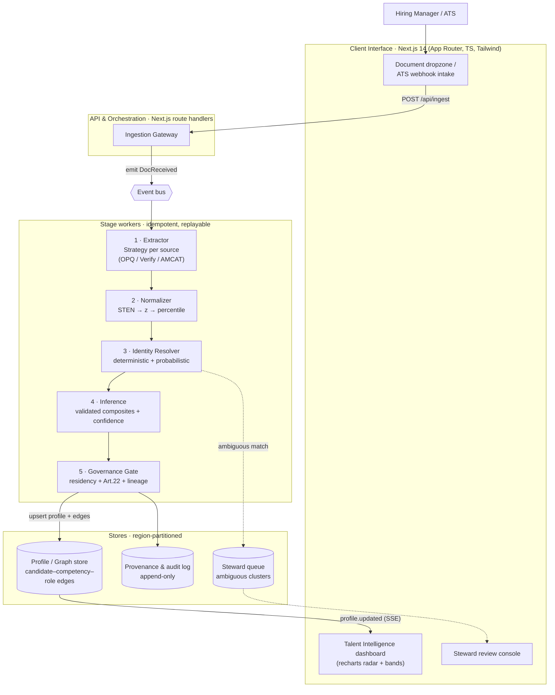

# SHL Unified Talent Intelligence Engine (UTIE)

A prototype **integration and inference layer** that unifies siloed SHL assessment artifacts — OPQ32 (personality), Verify G+ (cognitive), and AMCAT (skills / AMPI personality) — into a single, forward-looking talent profile. Built as a Next.js 14 (App Router · TypeScript · Tailwind) reference implementation of the architecture in [`SHL_UTIE_PRD.md`](./SHL_UTIE_PRD.md).

> Drop one report per silo. The pipeline extracts, normalizes STEN/percentile to a common metric, infers validated composites with confidence bands, and renders a radar — all from a single `POST /api/ingest`.

---

## 1. Why this exists

SHL grew through acquisition (AMCAT for technical assessment) while keeping flagship psychometrics (OPQ32, Verify G+). Architecturally they run on **isolated systems with different schemas and identifiers**. The business pain is concrete: a hiring manager assessing a senior candidate receives **fragmented artifacts** — a behavioural PDF from one system, a coding-score PDF from another. Correlating "influence" (OPQ) with "system-design skill" (AMCAT) is pushed onto the user. Managers ignore the nuance, revert to gut-feel interviews, and SHL's scientific ROI erodes.

UTIE moves SHL from a vendor of *point-in-time assessments* to an **Enterprise Talent Intelligence Platform** by adding an inference layer over (not in place of) the existing silos — async, no multi-year migration, and surfaced as **advisory input to a human decision** (Art. 22 compliant, never auto-decision).

See PRD §1 for the full business framing and §2 for explicit non-goals.

---

## 2. Strategic defensibility (the MOAT)

1. **Validated norm data** — composite weights are *empirically fitted* against real job-performance criteria using SHL's norm-group data.
2. **Criterion validity, published** — every composite ships with a stated criterion and an observed validity coefficient `r`. The asset is the *evidence chain*, not the number.
3. **Cross-domain correlation** — only SHL holds the joint distribution needed to relate a cognitive percentile to a behavioural profile with known confidence.
4. **Data gravity** — once a client's legacy data is transformed into a forward-looking skills graph, switching cost is prohibitive.

---

## 3. Architecture principles

| Principle | Decision |
|---|---|
| **Decouple ingestion from inference** | Event-driven pipeline; each stage is an idempotent, replayable consumer. A failed parse degrades, never corrupts. |
| **Earn validity, never assert it** | Composites are a *framework* hosting criterion-fitted weights + `r`. |
| **Common metric before combination** | All constructs → percentile (via `z`) before any arithmetic. STEN (normal) and percentiles (rank) are not linearly combinable as-is. |
| **Identity is a first-class problem** | Dedicated resolution stage, deterministic + probabilistic, with a steward queue for ambiguous matches. |
| **Privacy by design** | Region partitioning, purpose limitation, Art. 22 human-in-loop, full lineage. |
| **Confidence is explicit** | Every output carries a multi-factor confidence band. A composite from one stale source must not look like one from three fresh ones. |

---

## 4. Component view



This prototype implements the **highlighted hot path**: dropzone → gateway (`POST /api/ingest`) → extractor → normalizer → inference → confidence → dashboard. The event bus, governance gate, steward queue, and graph store are stubbed; they're MVP / Platform deliverables (see PRD §13).

---

## 5. Core domain model

All types live in [`src/types/domain.ts`](./src/types/domain.ts). Identity travels *apart from scores*, every score carries **provenance and uncertainty**, and `decisionUse: "ADVISORY_ONLY"` is a typed invariant rather than a comment.

| Type | Purpose |
|---|---|
| `SourceIdentity` | Name, email, DOB, hashed national ID — fed into the identity resolver. |
| `RawReport` | Source-shaped extract: `{ raw, scale: "STEN" \| "PERCENTILE" }`. |
| `NormalizedConstruct` | After normalization: `{ percentile, z, source, reliabilityAlpha, capturedAt }`. |
| `CompositeScore` | Per-composite output with `score`, `band`, `criterion`, `validity`, contributing weights, and missing inputs. |
| `ConfidenceBreakdown` | Four factors: `coverage`, `reliability`, `recency`, `agreement`, plus `total`. |
| `ProvenanceEntry` | Every contributing report + transform chain + identity-match method/score. |
| `UnifiedTalentProfile` | The final merged record. |

---

## 6. Processing pipeline

### 6.1 Extraction (`src/lib/extractors/`)

One `ParseStrategy<RawReport>` per source system. Each implements `canParse(text) → boolean` for auto-routing and `parse(text) → RawReport` for the actual lift.

| Source | Variant detection | Constructs extracted |
|---|---|---|
| **OPQ32** | `OPQ 32`, `Occupational Personality Questionnaire`, or STEN keyword + known dimension | Up to 32 personality dimensions (Persuasive, Outgoing, Conscientious, …) with 1–10 STEN values. Detects qualitative variants (Universal Competency Report, Manager Plus, Derailment) and rejects with a precise diagnostic — those reports have no machine-readable STEN scores. |
| **Verify G+** | `Verify G+`, `SHL Verify`, or "cognitive ability" + "percentile" | Reasoning subtests (Logical, Numerical, Verbal, Abstract, Inductive, Deductive, etc.) on the percentile scale. |
| **AMCAT** | `AMCAT`, `AMPI`, `Aspiring Minds`, or "employability" + "percentile" | Module percentiles (Coding, SQL, System Design, Data Structures, Algorithms, …) **plus** AMPI Big-Five traits (Extraversion, Conscientiousness, Neuroticism, Openness, Agreeableness) aliased to OPQ-compatible construct keys so they feed composites directly. |

On extraction failure the worker would emit an `ExtractionFailed` event and the profile would reflect *lower coverage* (and lower confidence). Missing data lowers confidence; it never fabricates a score.

### 6.2 Normalization (`src/lib/inference/normalize.ts`)

STEN is a normalized 1–10 scale (mean ≈ 5.5, sd ≈ 2). Percentiles are rank-based and non-linear. The two cannot be linearly combined as-is. The transform applied per construct:

```text
z          = (sten - 5.5) / 2.0
percentile = Φ(z) * 100            // Φ = standard normal CDF
```

`Φ` uses the Abramowitz & Stegun 7.1.26 erf approximation (max error < 1.5 × 10⁻⁷). Percentile inputs come straight through; we also back-compute `z` via `Φ⁻¹` (Acklam's rational approximation) for transparency / drift checks.

Per-source instrument reliabilities (Cronbach's α) used downstream by the confidence model and band calculation:

| Source | α |
|---|---|
| OPQ32 | 0.83 |
| Verify G+ | 0.88 |
| AMCAT | 0.79 |

### 6.3 Identity resolution

Sketched in PRD §6.3, not implemented in this prototype:

- **Deterministic pass** — exact match on `nationalIdHash` or verified email ⇒ confident merge.
- **Probabilistic pass** — weighted score: `0.45·name + 0.40·dob + 0.15·email`.
- **Thresholds** — `≥ 0.85` auto-merge; `0.55–0.85` steward review; `< 0.55` new entity.
- **GDPR erasure** — fans out across every silo-sourced fragment and to audit tombstones.

In the prototype each report is treated as belonging to the same candidate (single-profile demo).

### 6.4 Inference (`src/lib/inference/composites.ts`)

The engine is a **framework**, not a magic formula. Each composite declares: contributing constructs, regression-fitted weights, the criterion it predicts, and the observed validity `r`. Six composites ship with the prototype:

| Key | Criterion | Validity `r` | Contributing constructs (weight) |
|---|---|---|---|
| `architecturalForesight` | Supervisor-rated design quality (12-mo) | 0.42 | abstractReasoning (0.45), structure (0.30), logicalReasoning (0.25) |
| `executionResilience` | On-time delivery & defect rate (12-mo) | 0.38 | conscientious (0.30), relaxed (0.20), detailConscious (0.25), coding (0.25) |
| `stakeholderInfluence` | 360° peer influence rating | 0.36 | persuasive (0.40), outgoing (0.20), sociallyConfident (0.25), verbalReasoning (0.15) |
| `analyticalProblemSolving` | Live coding & case-study performance | 0.51 | logicalReasoning (0.30), numericalReasoning (0.25), dataStructures (0.25), algorithms (0.20) |
| `adaptiveLearning` | Time-to-productivity on new stack | 0.33 | innovative (0.25), varietySeeking (0.20), adaptable (0.25), inductiveReasoning (0.30) |
| `deliveryOwnership` | Manager-rated accountability | 0.40 | achieving (0.30), decisive (0.25), conscientious (0.20), systemDesign (0.25) |

Computation runs on the common percentile scale. When inputs are missing, **present weights are renormalized to sum to 1** so the score stays unbiased; the gap is recorded in `missingInputs` and the **band is widened**. The 90% half-width band is built from two sources of uncertainty:

```text
σ_instrument  = 28.87 · √(1 − meanAlpha)     // ~sd of uniform-ish 1..99 × reliability gap
inflation     = 1 + 1.5 · (missing weight share)
band (90%)    = 1.645 · σ_instrument · inflation
```

So a composite computed from one of four inputs has a much wider band than one computed from all four — exactly the signal the dashboard surfaces.

### 6.5 Confidence (`src/lib/inference/confidence.ts`)

Four factors, blended with the weights from PRD §6.5:

```text
coverage    = sourcesPresent / sourcesExpected
reliability = mean(instrument alpha across present sources)
recency     = mean( exp(-ageMonths / 24) )            // ~16.6-mo half-life
agreement   = concordance across overlapping constructs

confidence  = 100 · (0.35·coverage + 0.25·reliability
                     + 0.20·recency + 0.20·agreement)
```

`agreement` is `1 − normalisedStdDev` across constructs measured by more than one source. With no overlap, it falls back to within-set coherence. Two profiles can share a composite score yet differ sharply in confidence — that's the point.

---

## 7. Project layout

```
src/
├── app/
│   ├── api/ingest/route.ts        POST handler · pdf-parse → extract → normalize → infer
│   ├── globals.css
│   ├── layout.tsx
│   └── page.tsx
├── components/
│   ├── Dashboard.tsx              3 dropzones + radar + confidence (client component)
│   ├── SourceDropzone.tsx         react-dropzone wrapper per source
│   ├── CompositeRadar.tsx         Recharts RadarChart with band overlay + tooltip
│   └── ConfidencePanel.tsx        4-factor confidence + composite list
├── lib/
│   ├── extractors/                ParseStrategy<RawReport> per source + auto-detect
│   │   ├── opq32.ts · verifyG.ts · amcat.ts · shared.ts · types.ts · index.ts
│   └── inference/                 §6.2 normalize, §6.4 composites, §6.5 confidence
│       ├── normalize.ts · composites.ts · confidence.ts · stats.ts · index.ts
└── types/
    ├── domain.ts                  schemas exactly per §5
    ├── ingest.ts                  API response types
    └── pdf-parse.d.ts             ambient module for the internal pdf-parse entry
```

---

## 8. Getting started

```bash
# install
npm install

# dev server (http://localhost:3000)
npm run dev

# production build + start
npm run build
npm start

# typecheck only
npm run typecheck
```

Requires Node 18.18+ (or 20.x). The dev server hot-reloads on changes to `src/`. Drag a PDF into any of the three dropzones to populate the radar.

---

## 9. API

### `POST /api/ingest`

Multipart form upload. Returns the raw report, normalized constructs, computed composites, and the confidence breakdown.

**Form fields**

| Name | Type | Required | Notes |
|---|---|---|---|
| `file` | File (PDF) | yes | The assessment PDF. |
| `source` | `"OPQ32" \| "VerifyG" \| "AMCAT"` | no | Hint that routes directly to the matching extractor. If omitted, auto-detect runs. |

**Response (200)**

```jsonc
{
  "source": "AMCAT",
  "rawReport": {
    "reportId": "amc-…",
    "source": "AMCAT",
    "region": "US",
    "capturedAt": "2026-05-23T17:35:58.000Z",
    "identity": { "name": "…", "email": "…" },
    "raw": { "conscientious": 58, "outgoing": 65, "innovative": 51 },
    "scale": "PERCENTILE"
  },
  "constructs": [ /* NormalizedConstruct[] */ ],
  "composites": [ /* CompositeScore[] */ ],
  "confidence": { "total": 42.1, "coverage": 0.33, "reliability": 0.79, "recency": 0.96, "agreement": 0.78 }
}
```

**Failure modes**

| HTTP | When |
|---|---|
| 400 | Missing `file`, empty payload, or non-multipart body. |
| 422 | PDF parse failure, no extractable text, or no recognised constructs (with a precise diagnostic — e.g. "this OPQ32 variant has no numeric STEN scores"). |

---

## 10. UI walkthrough

- **Left column** — three dropzones (OPQ32, Verify G+, AMCAT). Each shows the supported report variant in a hint line, and renders a clear error if the wrong variant is uploaded (e.g. OPQ32 Universal Competency Report).
- **Right column, top** — Recharts radar with the composite scores. Each axis is a composite; the score is the primary line; the 90% confidence band is rendered as a translucent ring around it. Hover for `score ± band` and missing-input count.
- **Right column, bottom** — Confidence card with the four sub-factors as progress bars, plus a composite list showing `score · ±band · validity r · missing` for each.

The radar **recomputes on every successful upload**: constructs from all "ready" sources are merged, deduplicated by most-recent capture, and run through `computeAllComposites` + `computeConfidence` client-side. Identical logic to the server, so the radar updates without a round-trip.

---

## 11. Supported report variants (and what won't work)

| Source | ✅ Supported | ❌ Not supported |
|---|---|---|
| OPQ32 | Profile Report, Personality Report (numeric STEN per trait) | Universal Competency Report, Manager Plus, Derailment — these are qualitative/narrative and have no machine-readable STEN values. The extractor identifies the variant and returns a precise diagnostic. |
| Verify G+ | Score reports listing subtests with percentile values | Narrative interpretation reports without numerics |
| AMCAT | Score reports with module-level percentiles | n/a (the variant is detected) |
| AMPI | Big-Five trait percentiles (Extraversion, Conscientiousness, Neuroticism, Openness, Agreeableness) aliased to `outgoing`, `conscientious`, `innovative`, `caring` so they feed composites | n/a |

---

## 12. Governance & privacy (sketched)

This prototype runs everything in-process; production-level governance is described in PRD §8 and is the MVP / Platform deliverable:

- **Residency partitioning** — every profile is anchored to a region; EU data does not leave the EU partition. Cross-region rollups require an explicit consented purpose.
- **Purpose limitation & consent** — assessment data carries its collection purpose; reuse for a new inferred composite is checked against consent.
- **Article 22 (automated decision-making)** — any composite that could influence selection is **advisory only**, enforced by the typed `decisionUse: "ADVISORY_ONLY"` invariant and a human-in-loop step that records the human decision.
- **Lineage / audit** — every published composite is traceable to its source reports, transforms, and the identity-match method and score. Append-only, tamper-evident.
- **Fairness** — a new composite that influences hiring is, legally and scientifically, a **new instrument**. PRD §9 covers four-fifths monitoring, detector fairness (name-similarity bias on non-Latin-script names), and construct-distribution drift.

---

## 13. Non-functional targets

| Dimension | Target |
|---|---|
| Scale | ~35M assessments / yr ingest; bursty (campus seasons). Event bus absorbs spikes; workers scale horizontally. |
| Latency | Profile recompute < ~2 s after last source resolves. Inference is cheap; extraction/IO dominates. |
| Availability | Ingestion ≠ inference availability. Decoupling means a parse outage degrades, never fails. |
| Security | Encryption at rest/in transit; per-region keys; PII minimisation. Hash national IDs; never store raw where avoidable. |
| Auditability | 100% of decision-influencing outputs traceable. Append-only lineage. |

---

## 14. Trade-offs considered

| Decision | Chosen | Rejected | Why |
|---|---|---|---|
| Unify data | Inference layer over silos | Big-bang schema migration | Multi-year, high-risk; client value is immediate with a layer. |
| Score combination | Common percentile metric | Linear blend of raw STEN + percentile | The latter is statistically invalid. |
| Missing inputs | Renormalize + widen band | Substitute median | Median substitution fabricates signal and hides uncertainty. |
| Identity | Dedicated resolver + steward queue | Trust source IDs / single field | Source IDs differ; naive matching mis-merges humans. |
| Storage | Property graph (if edges are used) | "Graph DB" label on a flat doc | Don't claim a capability you don't model. |

---

## 15. Phased delivery

1. **Prototype (this repo)** — synchronous vertical slice: ingest, normalize, infer composites with confidence, render radar + bands.
2. **MVP** — real event bus, region partitioning, Art. 22 gate, ATS write-back for one ATS, adverse-impact dashboard.
3. **Platform** — graph-backed mobility/succession, drift monitoring, multi-tenant onboarding.

---

## 16. Stack

| Layer | Choice |
|---|---|
| App framework | Next.js 14.2 (App Router, route handlers) |
| Language | TypeScript (strict) |
| Styling | Tailwind CSS 3.4 |
| Icons | lucide-react |
| File intake | react-dropzone |
| PDF parsing | pdf-parse (Node runtime; internal entry to bypass its module-load sample-PDF read) |
| Charting | Recharts (RadarChart) |

---

## 17. Full specification

The complete product requirements / architecture spec lives in **[`SHL_UTIE_PRD.md`](./SHL_UTIE_PRD.md)** — 357 lines covering business context, MOAT, principles, sequence diagrams, schemas, pipeline, storage trade-offs, governance, fairness, integration, NFRs, and the phased delivery plan. This README condenses it; the PRD is authoritative.
