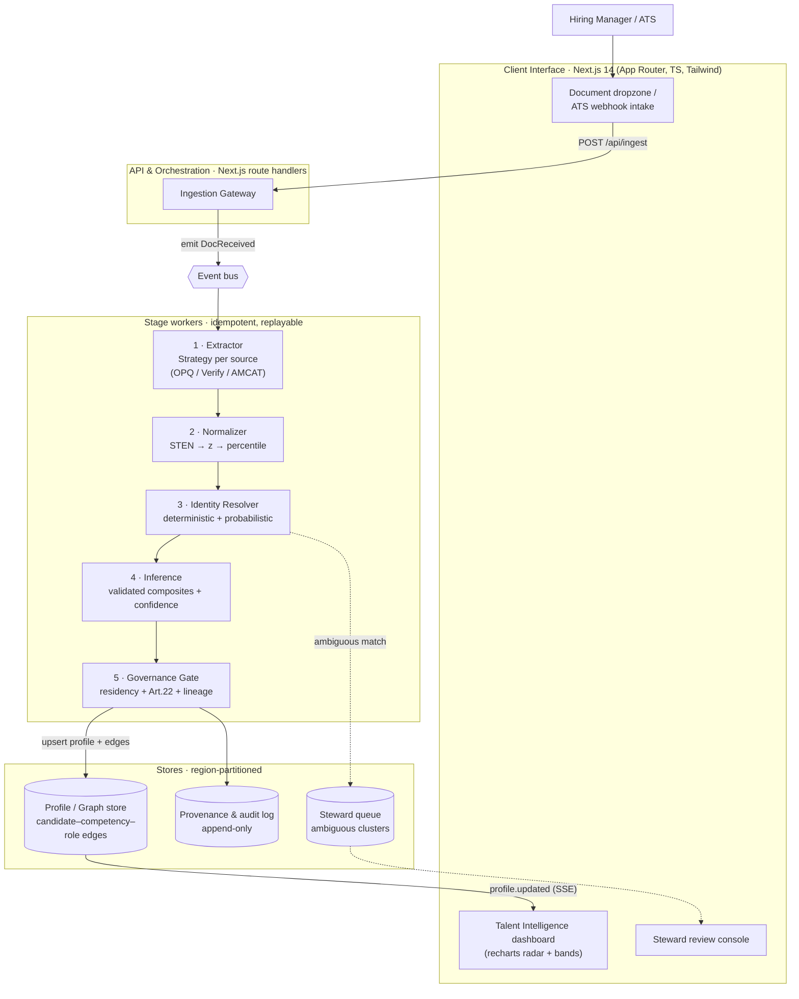
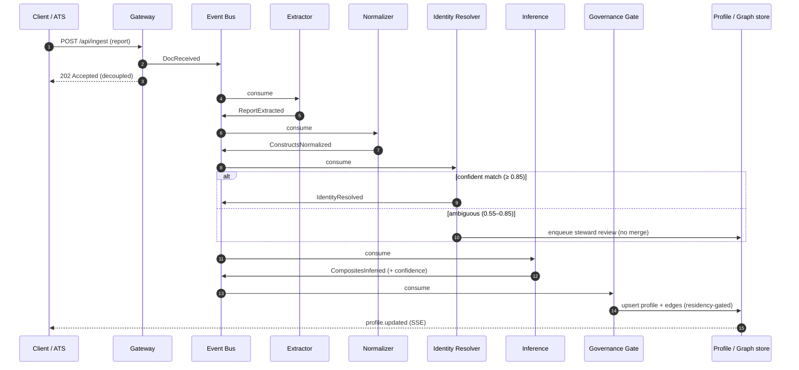
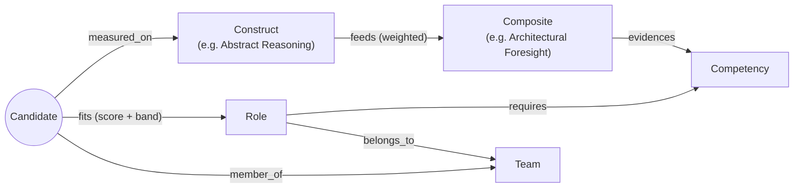

# System Design & Architecture: SHL Unified Talent Intelligence Engine

## 1. Business Context & Problem Statement

### The current gap
Over the past decade SHL has grown through acquisition (e.g. AMCAT for technical assessment) while maintaining flagship psychometrics (OPQ32, Verify G+). Architecturally these run on **isolated systems with different data schemas and identifiers**.

The business impact is concrete: when an enterprise client assesses a candidate for a senior role, the hiring manager receives **fragmented artifacts** — a behavioral PDF from one system, a coding-score PDF from another. The cognitive load of correlating "influence" (OPQ) with "system-design skill" (AMCAT) is pushed onto the user. The result is predictable: managers ignore the nuance, revert to gut-feel interviews, and the perceived ROI of SHL's science erodes.

### The need
SHL must move from a vendor of *point-in-time assessments* to an **Enterprise Talent Intelligence Platform**. We need an **integration and inference layer** that unifies these silos *asynchronously*, without a multi-year database migration, and surfaces forward-looking, role-relevant insight (e.g. "Architectural Foresight", "Execution Resilience") as **advisory input to a human decision**.

### The MOAT (strategic defensibility)
The defensibility is fourfold:

1. **Validated norm data.** Composite weights are *empirically fitted* against real job-performance criteria using SHL's norm-group and outcome data. A startup can copy a weighted sum in an afternoon; it cannot reproduce decades of criterion-validated STEN distributions.
2. **Criterion validity, published.** Each composite ships with a stated criterion and an observed validity coefficient (`r`). The asset is the *evidence chain*, not the coefficient.
3. **Cross-domain correlation.** Only SHL holds the joint distribution needed to relate a cognitive percentile to a behavioral profile with known confidence.
4. **Data gravity.** Once a client's legacy data is transformed into a forward-looking skills graph, switching cost becomes prohibitive.

---

## 2. Scope & Non-Goals

**In scope:** ingestion of existing per-silo reports; normalization to a common metric; identity resolution across silos; a validated composite-inference layer; a confidence model; governance (residency, Art. 22, audit); adverse-impact monitoring; a unified profile/graph store; client dashboard.

**Explicit non-goals:** authoring new assessments; replacing source systems; *automated* hiring decisions (the platform is decision-support, never the decider); re-validating the underlying instruments (we consume their published validity, we do not re-derive it).

---

## 3. Architecture Principles & Key Decisions

| Principle | Decision | Why |
|---|---|---|
| **Decouple ingestion from inference** | Event-driven pipeline; each stage is an idempotent consumer | A slow/failed PDF parse must never block or corrupt inference. Enables replay. |
| **Earn validity, never assert it** | Composites are a *framework* that hosts criterion-fitted weights + `r` | Survives scientific scrutiny; keeps the science auditable. |
| **Common metric before combination** | All constructs → percentile (via z) before any arithmetic | STEN (normal) and percentiles (rank) are not linearly combinable as-is. |
| **Identity is a first-class problem** | Dedicated resolution stage, deterministic + probabilistic, with a steward queue | Joining "the same human" across silos with different IDs is the hard 80%. |
| **Privacy by design** | Region partitioning, purpose limitation, Art. 22 human-in-loop, full lineage | Composites that influence selection are *new instruments* with legal exposure. |
| **Confidence is explicit** | Every output carries a multi-factor confidence band | A composite built from one stale source must not look like one built from three fresh ones. |

---

## 4. High-Level Architecture

The system uses an event-driven pipeline that decouples the ingestion of unstructured reports from the core inference engine. Each stage is an idempotent, replayable consumer.

### Component view



### Sequence view — event-driven, async (ingestion ≠ inference availability)



**Data flow, one hop at a time:** a report enters via dropzone or ATS webhook → gateway emits `DocReceived` → the source-specific extractor structures it → the normalizer converts every construct to a percentile → the resolver attaches it to the right person (or quarantines it) → inference recomputes composites and confidence over *all* of that person's evidence → the governance gate stamps residency/consent/lineage → the profile and its graph edges are upserted and the dashboard is notified.

---

## 5. Core Domain Model & Schemas

```typescript
// /src/types/domain.ts
export type Region = "EU" | "US" | "APAC";
export type SourceSystem = "OPQ32" | "VerifyG" | "AMCAT";

// --- Identity travels separately from scores (different per silo) ---
export interface SourceIdentity {
  name: string;
  email?: string;
  dob?: string;            // ISO; strong probabilistic signal
  nationalIdHash?: string; // deterministic key when present
}

// --- Raw, source-shaped extract ---
export interface RawReport {
  reportId: string;
  source: SourceSystem;
  region: Region;
  capturedAt: string;      // ISO — drives recency
  identity: SourceIdentity;
  raw: Record<string, number>;     // e.g. { influence: 8 } STEN, or { coding: 91 } pct
  scale: "STEN" | "PERCENTILE";
}

// --- After normalization: every construct on ONE metric ---
export interface NormalizedConstruct {
  construct: string;       // "influence" | "logicalReasoning" | ...
  percentile: number;      // 1..99  — the common metric
  z: number;               // for transparency / drift checks
  source: SourceSystem;
  reliabilityAlpha: number;// instrument Cronbach's alpha
  capturedAt: string;
}

// --- Per-composite output with provenance + uncertainty ---
export interface CompositeScore {
  key: string;             // "architecturalForesight"
  label: string;
  score: number | null;    // null when inputs insufficient
  band: number;            // ± half-width of the 90% interval
  criterion: string;       // what it predicts
  validity: number;        // observed r vs criterion
  contributingWeights: { construct: string; weight: number }[];
  missingInputs: string[]; // renormalized over present weights
}

// --- The unified record ---
export interface UnifiedTalentProfile {
  profileId: string;
  region: Region;                 // residency anchor
  constructs: NormalizedConstruct[];
  composites: CompositeScore[];
  confidence: ConfidenceBreakdown;
  provenance: ProvenanceEntry[];  // every contributing report + transform
  decisionUse: "ADVISORY_ONLY";   // enforced; never auto-decision
}

export interface ConfidenceBreakdown {
  total: number;        // 0..100
  coverage: number;     // sources present / expected
  reliability: number;  // mean instrument alpha
  recency: number;      // exponential decay on capture age
  agreement: number;    // concordance across overlapping constructs
}

export interface ProvenanceEntry {
  reportId: string; source: SourceSystem; capturedAt: string;
  transforms: string[];           // ["sten->z","z->percentile"]
  identityMatch: { method: "deterministic" | "probabilistic"; score: number };
}
```

Identity is modelled *apart* from scores, every score carries **provenance and uncertainty**, and `decisionUse` is a typed invariant rather than a comment.

---

## 6. The Processing Pipeline

### 6.1 Ingestion & extraction
One extractor per source system implements `ParseStrategy<RawReport>`. On extraction failure the worker emits an `ExtractionFailed` event, the report is quarantined, and the profile reflects *lower coverage* (and therefore lower confidence). Missing data lowers confidence; it never fabricates a score.

### 6.2 Psychometric normalization
STEN is a **normalized 1–10 scale** (mean ≈ 5.5, sd ≈ 2); percentiles are **rank-based** and non-linear. The two cannot be linearly combined as-is. Transform applied per construct:

```
z         = (sten - 5.5) / 2.0
percentile = Φ(z) * 100            // Φ = standard normal CDF
```

Every construct — behavioral or cognitive — lands on the **percentile** metric *before* any combination happens. This is what makes the downstream math defensible.

### 6.3 Identity resolution
The genuine hard problem, with its own stage:

- **Deterministic pass:** exact match on `nationalIdHash` (or verified email) ⇒ confident merge.
- **Probabilistic pass:** weighted score over `name` similarity, `dob` exactness, `email` exactness — e.g. `0.45·name + 0.40·dob + 0.15·email`.
- **Thresholds:** `≥ 0.85` auto-merge; `0.55–0.85` ⇒ **steward review queue** (no merge); `< 0.55` ⇒ new entity. A near-miss (same name, different DOB/national-ID) must *not* auto-merge.
- **GDPR erasure propagation:** an erasure request fans out to *every* silo-sourced fragment in the cluster and to the audit log's tombstones.

### 6.4 Inference framework
The engine is a **framework**, not a magic formula. Each composite declares its contributing constructs, **regression-fitted weights**, the **criterion** it predicts, and the observed **validity `r`**:

```typescript
{
  key: "architecturalForesight",
  criterion: "Supervisor-rated design quality (12-mo)",
  validity: 0.42,
  weights: [
    { construct: "abstractReasoning", weight: 0.45 },
    { construct: "structure",         weight: 0.30 },
    { construct: "logicalReasoning",  weight: 0.25 },
  ]
}
```

Computation runs on the common percentile scale and **renormalizes over present weights** when an input is missing, recording the gap in `missingInputs` and widening the band.

### 6.5 Confidence index
Four factors, combined and surfaced:

```
coverage    = sourcesPresent / sourcesExpected
reliability = mean(instrument alpha across present sources)
recency     = mean( exp(-ageMonths / 24) )      // ~16.6-mo half-life
agreement   = concordance across overlapping constructs
confidence  = 100 · (0.35·coverage + 0.25·reliability
                     + 0.20·recency + 0.20·agreement)
```

Two profiles can share a composite score yet differ sharply in confidence.

---

## 7. Data Storage Architecture

Two options, stated as a trade-off:

| Option | When it's right | Cost |
|---|---|---|
| **Profile/document store** (region-partitioned Mongo/DocumentDB) | If the product is per-candidate readout only | Cheap, simple; relationship queries get awkward |
| **Property graph** (Neptune / Neo4j) | If the talent-intelligence value is *relational* — internal mobility, succession, team composition | Higher ops cost; justified only if we use the edges |

A graph is justified **because the differentiated value lives in the edges**:



Queries that matter — *who is the best internal fit for this open role*, *which teams are thin on a given competency*, *succession candidates for a leadership role* — are edge traversals, not document scans. Either way the store is **region-partitioned** (see §8). An append-only **provenance/audit log** sits alongside, separate from the mutable profile.

---

## 8. Governance, Privacy & Residency

- **Residency partitioning:** each profile is anchored to a region; **EU data does not leave the EU partition**. Cross-region rollups are gated, not default — they require an explicit, consented purpose.
- **Purpose limitation & consent:** assessment data carries the purpose it was collected for; reuse for a new inferred composite is checked against consent.
- **Article 22 (automated decision-making):** any composite that could influence selection is **advisory only**; the platform enforces a human-in-the-loop and records the human decision. Encoded as the `decisionUse: "ADVISORY_ONLY"` invariant.
- **Lineage / audit:** every published composite is traceable to its source reports, transforms, and the identity-match method and score — append-only, tamper-evident.

---

## 9. Fairness & Adverse Impact

A new composite that influences hiring is, legally and scientifically, a **new instrument** and must be monitored for adverse impact (US EEOC Uniform Guidelines; equivalent EU frameworks).

- **Four-fifths monitoring:** at any selection threshold, compute selection rate per protected group; flag when the impact ratio falls below 0.8.
- **Detector fairness:** the confidence model and identity matcher are themselves audited for group bias (e.g. name-similarity matching can disadvantage non-Latin-script names).
- **Drift:** monitor construct distributions over time; validity is not static.

---

## 10. Integration Architecture

- **Ingress from SHL systems:** consume existing report exports / events from OPQ32, Verify G+, AMCAT — the layer sits *over* them, no migration.
- **Enterprise auth:** SSO via SAML/OIDC; **multi-tenant** isolation per client.
- **Egress to the client's world:** ATS write-back (Workday, SuccessFactors, Greenhouse) so insight lands where managers already work.
- **APIs:** `POST /api/ingest` (intake), `GET /api/profile/:id` (read), `GET /api/steward/queue` (review), `SSE /api/stream` (`profile.updated`).

---

## 11. Non-Functional Requirements

| Dimension | Target | Note |
|---|---|---|
| Scale | ~35M assessments/yr ingest; bursty (campus seasons) | Event bus absorbs spikes; workers scale horizontally |
| Latency | Profile recompute < ~2s after last source resolves | Inference is cheap; extraction/IO dominates |
| Availability | Ingestion ≠ inference availability | Decoupling means a parse outage degrades, not fails |
| Security | Encryption at rest/in transit; per-region keys; PII minimization | Hash national IDs; never store raw where avoidable |
| Auditability | 100% of decision-influencing outputs traceable | Append-only lineage |

---

## 12. Trade-offs & Alternatives Considered

| Decision | Chosen | Rejected | Why |
|---|---|---|---|
| Unify data | Inference layer over silos | Big-bang schema migration | Multi-year, high-risk; client value is immediate with a layer |
| Score combination | Common percentile metric | Linear blend of raw STEN + percentile | The latter is statistically invalid |
| Missing inputs | Renormalize + widen band | Substitute median | Median substitution fabricates signal and hides uncertainty |
| Identity | Dedicated resolver + steward queue | Trust source IDs / single field | Source IDs differ; naive matching mis-merges humans |
| Storage | Property graph (if edges are used) | "Graph DB" label on a flat doc | Don't claim a capability you don't model |

---

## 13. Phased Delivery

1. **Prototype:** synchronous vertical slice — ingest seeded extracts, normalize, resolve identity (incl. one steward case), infer composites with confidence, render radar + bands.
2. **MVP:** real event bus, region partitioning, Art. 22 gate, ATS write-back for one ATS, adverse-impact dashboard.
3. **Platform:** graph-backed mobility/succession, drift monitoring, multi-tenant onboarding.
